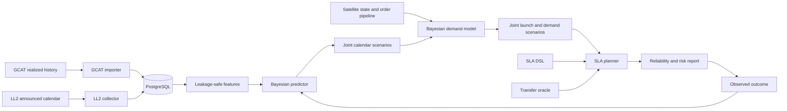

# Architecture and module usage

## Product question

The intended application answers:

> Given current assets, inventory, accepted SLAs, and uncertain future launch
> opportunities, should a new SLA be accepted, at what price and reliability,
> and which commitments must be made now?

The current repository establishes the data and physics foundation. The
Bayesian predictor, optimizer, risk evaluator, and interface remain to be
implemented.

## Module map

```text
SLA/
  edelbaum.py, phasing.py, propagate.py, nodes.py
      analytical transfer and orbit utilities
  costtable.py, schedule.py, demands.py, servicer.py
      inherited planning primitives and reference structures
  dsl/
      SLA v0.1 JSON schema, compiler, validator, and examples
  services/
      extensible service definitions; commodity delivery is implemented
  launch_generator/
      forecast/scenario contracts, archive and scoring
    ingestion/
      GCAT normalization and LL2 collection/revision detection
  storage/
      PostgreSQL schema, migrations, source snapshots and calendar repositories
  demand_forecast/
      Bayesian future-SLA demand generation, launch coupling and scheduler adapter
```

## Intended end-to-end flow



## Analytical transfer layer

`SLA.edelbaum` implements the existing thrust-coast-thrust Edelbaum estimate
with J2 RAAN closure. It is intentionally isolated so a higher-fidelity oracle
can replace it later.

Main functions:

- `transfer_dv`: one transfer/time-of-flight query.
- `transfer_cost`: one orbit pair over several times of flight.
- `transfer_cost_grid`: departure/time-of-flight grids.

The model assumes circular or near-circular low-thrust transfers, constant
thrust and specific impulse, and secular J2 drift. It does not model exact
rendezvous, eccentric optimal control, eclipse/power constraints, collision
avoidance, or full guidance.

## SLA DSL

The DSL turns service definitions and planning state into typed Python objects.
It contains:

- Accurate UTC `as_of` timestamp.
- Current assets, inventory, servicers, commitments, and requests.
- Relative seconds for windows and durations.
- Service-specific payload under the `service` field.

Implemented examples cover refuelling, repair, and deorbit. The DSL describes
the decision input; it does not currently solve the allocation problem.

## Services

`SLA.services.registry` maps service names to service implementations.
`commodity_delivery.py` validates and interprets delivery/refuelling requests.
New service types should implement the same registry boundary rather than add
service-specific conditions throughout the planner.

## Launch-access contracts

`SLA.launch_generator.models` defines:

- `EvidenceAssertion`: source-backed structured claim.
- `LaunchOpportunity`: coupled launch time, vehicle/site/orbit, capacity,
  price, deadline, occurrence probability, and evidence.
- `LaunchScenario`: probability-weighted complete calendar.
- `ForecastSnapshot`: versioned scenario set with UTC `as_of`, horizon,
  evidence snapshot, model version, and seed.
- `RealizedLaunch`: observed outcome used for scoring and updating.

`archive.py` provides JSON round trips. `scoring.py` currently provides Brier
score and interval coverage. More proper scores are planned with the Bayesian
model.

## Service-demand forecast

+`SLA.demand_forecast` implements the research baseline for future SLA arrivals.
+Confirmed orders appear in every scenario, pipeline orders have explicit conversion
+probabilities, and unobserved demand follows a state-dependent Gamma-Poisson process.
+Satellite age, design life and health scale exposure. Generated request marks include
+target orbit, service type, release, deadline, duration, value and inventory use.
+
+`BayesianDemandModel.update` performs conjugate posterior updates from observed events
+and weighted satellite-seconds. `joint_forecast` activates planned satellites only
+when their linked launch occurs, retaining the coupling between launch uncertainty,
+the future installed base and service demand. `to_scheduler_demands` converts a sampled
+request set to the existing optimization contract.
+
+## Persistence boundary

The database distinguishes:

1. **Raw source object:** unique response bytes keyed by SHA-256.
2. **Source retrieval:** source, request URI, UTC retrieval time, licence state,
   and the raw object it returned.
3. **Canonical event:** realized GCAT launch and payload records.
4. **Announced state:** an LL2 launch as seen in a particular snapshot.
5. **Revision:** a field-level difference between two LL2 states.

This supports deduplication without losing the fact that an unchanged response
was observed repeatedly.

## Planned forecasting boundary

The first predictor will combine:

- A hierarchical negative-binomial provider/time count model.
- An announced-mission launch/delay/cancellation hazard model.
- Conditional provider, vehicle, site, and orbit marks.
- Manifested payload-demand distributions.
- Projected accessible capacity derived from technical capacity, manifested
  demand, and an explicit commercial-accessibility factor.
- Posterior updates and a separate residual-calibration layer.

The output is a learned joint distribution. Calibrated uncertainty sets are
derived from it for robust planning.

## Planned SLA risk boundary

Reliability is the probability that the DSL requirements are met under the
proposed policy and current portfolio. Risk combines failure probability with
conditional loss and reports expected loss, tail loss, evidence confidence,
drivers, incremental portfolio risk, and mitigation sensitivity.

Risk learning will use realized fulfilment, lateness, cause, recovery action,
cost, penalty, claim, and portfolio effects. Until such data exist, loss inputs
must be labelled contractual or assumed.
